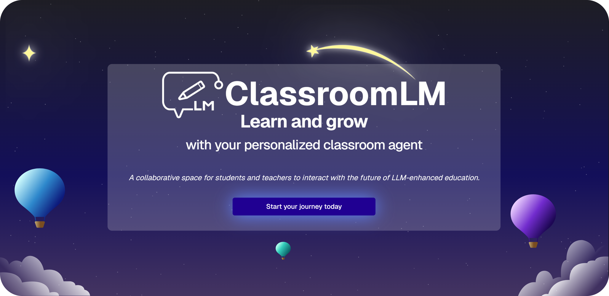
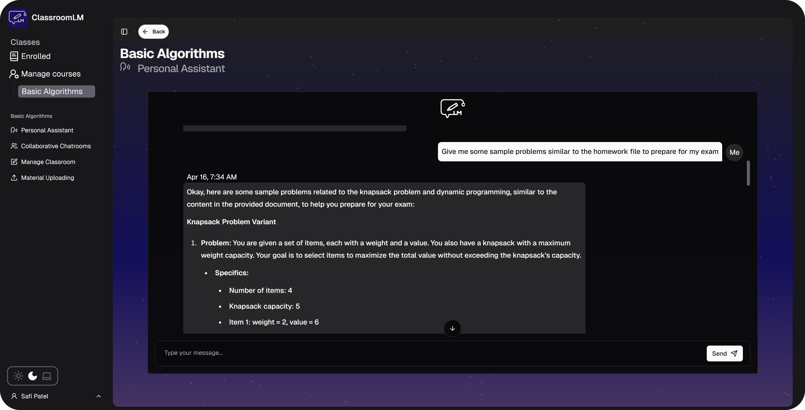
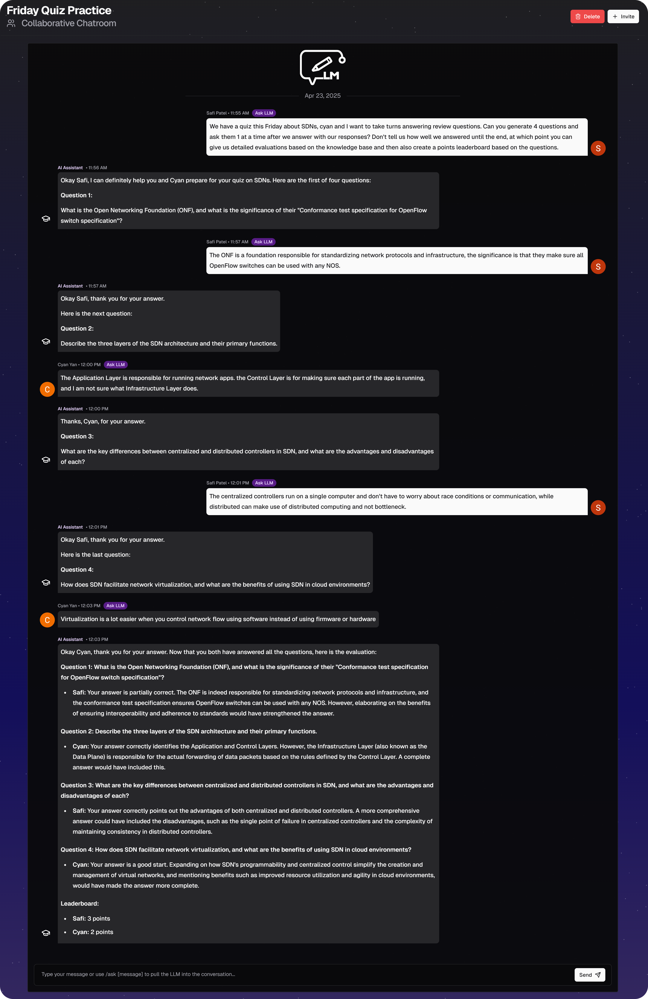

# ClassroomLM



**ClassroomLM provides each classroom within an educational organization a specialized LLM assistant that is specific and accurate to the subject matter and resources of its particular classroom.**

---

ClassroomLM's main value comes from its core application framework. Retrieval Augmented Generation (RAG) makes AI assistants more accurate, grounded, and specific by basing their answers on a knowledge base. ClassroomLM is unique in its mechanism of having a siloed knowledge base per classroom so that RAG can be conducted separately on specific classroom contexts. The additional features (like the collaborative chat, auto-generating review materials, etc.) are layered on top of this core mechanism.

## Application Walkthrough

<!-- markdownlint-disable MD034 -->

https://github.com/user-attachments/assets/b7ad1a0c-9046-400d-9c53-89554de16738

> ClassroomLM can enhance learning, access to information, ease of use of AI systems across all kinds and levels of educational institutions. While geared towards classrooms, once ClassroomLM is in place at an institution it can also help subgroups conducting research, administrators with internal documentation, and even for other adjacent organizations, like clubs and student associations that want to easily give access to an assistant specific to their documents and resources.

## Features

### **Classroom-Style Structure**

Teachers can create classrooms, upload documents (PDFs, slides, handwritten notes), and invite students.


### **Classroom-Specific AI Assistants**

**_Each classroom has access to an LLM assistant that is RAG-enabled, allowing it to be more specific and accurate, while also being more grounded and capable of retrieving information from the class' resources, unlocking greater potential for engaging learning, peer interaction, and more._**



#### **Advantages over current user-facing AI assistant systems**

**More accurate, specific, and grounded**: ClassroomLM's LLM assistant
provides responses with full awareness and knowledge of the classroom's specific or niche context, rather than operating in the default context of LLMs: the entire world/internet's knowledge.

> **Use case example**: An NYU Professor has a variation of assembly created specifically for the classroom, called E20. Putting the E20 manual into the shared classroom dataset gave all students within this classroom access to **an assistant that is now specialized, knowledgeable, and with full context of this niche, not-seen-before language personally created by a professor.** \
> Compared to ClassroomLM, other user-facing assistant systems gave vague, nonspecific, and non-accurate answers relevant to other assembly variants.

---

**Logistical and practical benefits**: Created knowledge bases are shared across the entire classroom eliminating a need to individually upload.

Rather than an entire classroom's worth of students having to upload their documents individually, keep it up to date with new resources, and separate it from other classes (and repeat all that across all classrooms in an org), **having a shared knowledge base for an entire classroom (but siloed from other classes) reduces the overhead, friction, and effort, while also allowing for superior use of those resources.**

> Implementing this core mechanism now provides a foundation for all the features that could benefit from having shared knowledge bases for subgroups.

---

**Powerful and highly flexible abilities**:
**ClassroomLM brings out the full potential of LLM assistants** for educators and students, meaning the **existing,** highly flexible **powers** and capabilities of LLMs that people expect are not only **retained, but enhanced.**

- The assistant can be used to generate exam questions, review material, interrogate the classroom documents, have a discussion about the content, judge and correct your own understanding, and many other tested abilities, and with even more possible.
- And again, **in comparison to existing user-facing systems, all of these will be more accurate and specific because of the grounding that comes from the classroom's resource dataset.**

---

**Tested in diverse contexts**:
In terms of contexts, ClassroomLM was tested to be useful for subjects ranging from physics, different math topics, computer science, different topics within the humanities, etc. As an example, for something like philosophy, a class with many texts, ClassroomLM shines because it's able to synthesize across the many readings, and without each student having to reupload all documents.

### **Collaborative Chats with ClassroomLM**

**_Group chats with other class members and an AI assistant that's a full conversation participant, not just a bot responding to one-off Q&As_**

- Students can create multiple chatrooms per classroom and choose who to invite within each chatroom.
- Within the chatroom, students can pull the LLM into the conversation in the manner of a group chat with the **`/ask [message]`** command.
- The assistant in this case retains all the benefits described above for the personal chat, as it is also RAG enabled.

#### Unique to ClassroomLM: Collaborative chat with full conversation context _and_ grounded with RAG on a classroom's resources

- With ClassroomLM, when triggered with the `/ask` command the LLM will have knowledge of the previous conversation and respond accordingly.
  - Will make corrections to messages even if other discussion occurred in the meantime and otherwise **act like a full participant in the conversation, rather than just a bot that you Q&A one-off messages.**
- This is **unlike the common implementations of a "group chat with an AI assistant" idea very often found in company Slacks, etc.** where the LLM is only aware of the message that triggered it and responds just to that.
  - The only benefit of those implementations, compared to just personally asking an LLM, is that everyone in the chat witnesses the Q&A. **ClassroomLM is much more powerful than this simplistic approach**.

#### Collaborative chat example


  <!-- <details>
  <summary>
  test
  </summary>
   -->

#### Collaborative chat, advanced interactivity example

<!-- markdownlint-disable MD033 -->

- Here, we see the ClassroomLM assistant behaving as an actual conversation participant—in this example, <ins>**it successfully understands that it needs to keep giving new questions one-by-one within a group review session and waiting till the end to evaluate**</ins>.
- We also see that the **questions are rooted in the knowledge base**, and that the **evaluation correctly and faithfully sticks to the resources** to provide additional relevant context and give feedback.
  

## Technical Overview


**ClassroomLM builds on top of the [RAGFlow](https://github.com/infiniflow/ragflow) engine.** This is an open-source RAG (Retrieval-Augmented Generation) engine with the benefits of being polished, actively-maintained, and mature. \
This is especially true in terms of handling bugs and having a comprehensive and [well-documented HTTPS API](https://ragflow.io/docs/v0.19.0/http_api_reference) for the ClassroomLM application to utilize.

### RAGFlow vs. ClassroomLM's responsibilities

As seen above in the diagram, the **RAGFlow** instance (note that it's self-hosted) is responsible for storing the documents within knowledge bases and handling RAG functionality during LLM chats. **ClassroomLM is responsible for the layer above this in terms of managing classrooms, collaborative chats, etc**. For example, the ClassroomLM application is what links the siloed datasets within RAGFlow to the corresponding classroom for all LLM assistant functionality.

## Usage

For both development and deployment, the **instructions below need to be followed** to ensure you have a RagFlow and Supabase instance running. The only difference is that development could mean you can just have local versions of those two things.

### 1. Set up [RagFlow](https://github.com/infiniflow/ragflow)

Follow [the instructions on the Ragflow docs](https://ragflow.io/docs/dev/) to **deploy and configure** it. This includes choosing the LLM to use, with many supported options to choose from.\
Note the deployment method they detail in the docs are with Docker Compose. Alternatively, they also have a [helm chart](https://github.com/infiniflow/ragflow/tree/main/helm) to deploy RagFlow onto a Kubernetes cluster.

> Note: since we're deploying our web app onto port 8080 as per our [Dockerfile](https://github.com/TechAtNYU/dev-team-spring-25/blob/main/Dockerfile), depending on whether or not your RagFlow engine is deployed on the same machine/network as the ClassroomLM application, you might need to change the port for RagFlow's web interface.
> Follow the instructions [here to update the HTTP and HTTPS port](<https://ragflow.io/docs/dev/configurations#:~:text=To%20update%20the%20default%20HTTP%20serving%20port%20(80)%2C>) away from 80 and 443 if you would not like RagFlow's web interface to occupy them.

#### Create a RagFlow API Key

Follow the [instructions on the RagFlow docs](https://ragflow.io/docs/dev/acquire_ragflow_api_key) to create an API key.

### 2. Set up Supabase

[Supabase](https://supabase.com/) can be self-hosted. Most likely, this is the better option since you'll need to host RagFlow somewhere anyway. Follow the [instructions here](https://supabase.com/docs/guides/self-hosting) to see how to self host a Supabase instance using Docker Compose, Kubernetes, etc.

Otherwise, you can choose to use Supabase's hosted service, which also [has a free tier](https://supabase.com/pricing).

If you're only developing locally, you can take a look at [this section on the Supabase docs.](https://supabase.com/docs/guides/local-development/cli/getting-started?queryGroups=platform&platform=npm#running-supabase-locally)

#### Clone the repository

```bash
git clone https://github.com/TechAtNYU/dev-team-spring-25.git
cd dev-team-spring-25
```

#### Provision Supabase instance

First, [install the Supabase CLI](https://supabase.com/docs/guides/local-development/cli/getting-started). If you already have the `npm` dependencies installed from the development setup, then you should already have it.

Next, get the _`CONNECTION_STRING`_. You can either use the dashboard and press **Connect** on the top left. Or see the `Accessing Postgres` [section of the self-hosted Supabase docs.](https://supabase.com/docs/guides/self-hosting/docker#accessing-postgres)

If you don't already have it, [get the Postgres CLI.](https://www.postgresql.org/download/)
And finally, run the following command to automatically set up the tables, functions, trigger, realtime functionality, etc. Replace `[CONNECTION_STRING]` with what you determined above.

```bash
psql --single-transaction -variable ON_ERROR_STOP=1 --file supabase-setup.sql --dbname [CONNECTION_STRING]
```

#### Set up Supabase Auth with Google OAuth

Follow the [instructions on the Supabase docs to set up Google OAuth](https://supabase.com/docs/guides/auth/social-login/auth-google?queryGroups=platform&platform=web#configuration) since it's required to add users.\
Note that for the parts in the instruction where you need the Supabase dashboard, you still have this even if you self-hosted it. (The dashboard is exposed at port 8000 by default).

#### Add allowed domains to database

Either by connecting to the database through the `psql` CLI or through the Supabase dashboard (recommended), add any allowable domains to the `Allowed_Domains` table.\
When a user signs in with Google, it will only work if their Google account's address is found in table. E.g. for `user@domain.com`, `domain.com` must be an entry in `Allowed_Domains`.

Add a domain (or multiple) in the following manner to `Allowed_Domains`:

| id  | domain  |
| --- | ------- |
| 1   | nyu.edu |

**Note**: In the section below, you'll see that you need to add the allowed domains to the `.env` file as well.

### 3. Add config info

Create a `.env` file in the root of the repository based on [`.env.example`](https://github.com/TechAtNYU/dev-team-spring-25/blob/main/.env.example).

Explanation of each variable:

| Env Variable                      | Description                                                                                                                                                                                                                 |
| --------------------------------- | --------------------------------------------------------------------------------------------------------------------------------------------------------------------------------------------------------------------------- |
| NEXT_PUBLIC_SUPABASE_URL          | Use either the given Supabase URL from the hosted version or a custom URL from your self-hosted solution                                                                                                                    |
| NEXT_PUBLIC_SUPABASE_ANON_KEY     | Available in Supabase's dashboard or CLI                                                                                                                                                                                    |
| NEXT_PUBLIC_SITE_URL              | The root URL for the site, to be used for callbacks after authentication                                                                                                                                                    |
| NEXT_PUBLIC_ALLOWED_EMAIL_DOMAINS | When users login with Google, these are the only email domains allowed to sign up.&#10;**Note that this is also needs to be [configured in the `Allowed_Domains` table within Supabase](#add-allowed-domains-to-database)** |
| NEXT_PUBLIC_ORGANIZATION_NAME     | The name of the organization for display purposes                                                                                                                                                                           |
| SUPABASE_SERVICE_ROLE_KEY         | Available in Supabase's dashboard or CLI                                                                                                                                                                                    |
| RAGFLOW_API_KEY                   | [See above](#create-a-ragflow-api-key) on how to make this key                                                                                                                                                              |
| RAGFLOW_API_URL                   | Publicly available hostname to access RagFlow's API                                                                                                                                                                         |

### Deployment

This section is for deploying ClassroomLM, scroll down below to see the setup for [Development](#development). Currently, only Kubernetes is supported as a deployment option.

#### Add configuration info to kubernetes files

Put the same information from `.env` into the `k8s/config.yaml` and `k8s/secret.yaml` (the info is split among those two files.)\
Note: the same info is duplicated because NextJS requires the environment variables at build time too.

#### Build Docker image

Next, we build the image with the following command, with your registry information filled in (if necessary). What's important is that the tag matches the tag used in the deployment file later.

```bash
  docker build -f Dockerfile -t [registry host]:[registry port]/classroom-lm/classroom-lm-app:latest .
```

#### Change `k8s/deployment.yaml` and deploy

Change the **container image** within `k8s/deployment.yaml` to match the image tag in the previous step.

Then deploy:

```bash
kubectl apply -f k8s
```

### Development

1. Install dependencies:\
   Assuming NPM is installed, we [recommend installing `pnpm`](https://pnpm.io/installation).\
   Then, run the following in the root directory:

   ```bash
   pnpm install
   ```

2. Start the development server:

   ```bash
   pnpm dev
   ```

   The application will be available at [http://localhost:8080](http://localhost:8080)

### Repository contents

- `app`: Under the NextJS app router paradigm, everything within this directory matches the structure of the actual routes for the application.
- `shared/components`: Components used multiple times within the app directory, including those from [ShadCN](https://ui.shadcn.com/).
- `shared/lib`: Shared code for Supabase, an abstraction layer for RagFlow, and a React ContextProvider to give user and classroom information to pages.
- `shared/utils/supabase`: Used for the creation of different types of clients, typing Supabase calls, and handling middleware. Most code here is sourced from [Supabase's Server-Side Auth for NextJS reference](https://supabase.com/docs/guides/auth/server-side/nextjs?queryGroups=router&router=app).

#### Available Scripts

- `pnpm dev` - Start development server
- `pnpm build` - Build the application for production
- `pnpm start` - Start the production server
- `pnpm test` - Run tests in watch mode
- `pnpm test:run` - Run tests once
- `pnpm test:ui` - Run tests with UI
- `pnpm coverage` - Generate test coverage report
- `pnpm lint` - Run ESLint
- `pnpm lint:fix` - Fix ESLint issues
- `pnpm format` - Format code with Prettier
- `pnpm format:check` - Check code formatting

## Credits
<a href="https://techatnyu.org"></a>\
ClassroomLM was initially created by the first cohort of [Tech@NYU's](https://techatnyu.org) Dev Team Program in the Spring 2025 semester.

**Tech Lead**: Safi Patel\
**Program Manager**: Sanjay Chunduru\
**Developers**: Yixiang Chen, Joseph Cheng, Pranit Singh Gandhi, Xiaomin Liu, Shubham Parab, Emily Silkina, Kavya Srikumar, Austin Tan, Benjamin Tian, Chenxin Yan\
**Product design**: Jennifer Huang, Haley Ngai
