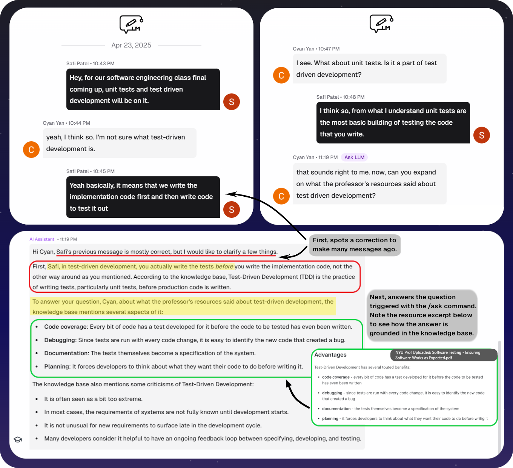

# ClassroomLM


ClassroomLM provides each of the many classrooms within an organization a specialized LLM assistant that is specific and accurate to the subject matter and resources of that particular classroom.

> ???? Makes sense for classrooms in primary education or universities, and even for other adjacent organizations like clubs and student associations that want easy access to giving an AI assistant to their members specific to their documents.

The core feature and main value that ClassroomLM provides is the application's framework of having siloed knowledge bases per classroom to conduct Retrieval Augmented Generation (RAG) on, with the additional features like collaborative chat layered on top of this.

[video walktrhough of everything]

## Features

### **Classroom-Style Structure**

Teachers can create classrooms, upload documents (PDFs, slides, handwritten notes), and invite students.

Diagram of docs to classes (maybe add it sidebyside to main classroom page screenshot?)

### **Classroom-Specific AI Assistants**

Each classroom has access to an LLM assistant that is enabled by RAG, allowing it to be more specific and accurate, while also being better and smarter at retrieving information from the class' resources.

#### **Advantages over current user-facing AI assistant systems with use case examples**

- **More accurate and specific**: can operate in specific or even specially created context just for classrooms.
  > **Use case example**: An NYU Professor has a variation of assembly created specifically for the classroom, called e20. Putting the e20 manual into the shared classroom dataset gave all students within this classroom access to an assistant that is now specialized, knowledgeable, and with full context of this niche, not-seen-before language personally created by a professor. \
  > Comparing it to existing systems, they gave vague, non-specific, and non-accurate answers relevant to other assembly variants.
- **Logistical and practical benefits**: knowledge bases shared across entire classroom
  - Rather than an entire classroom's worth of students across all of their individual classes having to upload their documents individually, keep it up to date with new resources, and separate it from other classes, having a shared (but siloed) knowledge base for an entire classroom reduces the overhead, friction, and allows for superior use of resources.
- \*\*Diverse ability and

  - Humanities, etc.

    <!-- Building conversation context            |  Continues and LLM triggered with /ask | LLM responds
  :-------------------------:|:-------------------------: |:-------------------------:
   border: black 2px solid; 
     |  -->
    <!-- <p float="center" align="middle" style="
   padding-top: 5px; border-radius: 10px;">
    
     <br>
    
  </p> -->

### **Collaborative AI Chats**

Group chat support with other students the AI can participate with full chat context.

- Students can create multiple chatrooms per classroom and choose who to invite within each chatroom.
- Within the chatroom, students can pull the LLM into the conversation in the manner of a group chat with the **`/ask [message]`** command.
- The assistant in this case retains all the benefits described above for the personal chat, as it is also RAG enabled.

  > To be clear, this isn’t the common implementation of a "group chat with an assistant" very often found in company Slacks, etc. where the LLM is just responding to the message that triggered it. In that case, it's only more useful than just doing asking the LLM personally since the answer is visible to everyone. Instead here, when triggered with the `/ask` command the LLM will have knowledge of all the previous conversation and respond accordingly, as if it’s just part of the conversation.

  

## Technical Overview

Diagram showing where evrything is stored
RagFlow has knowkedge bases, stores actual docs
Stores personal chat history

Supabase stores user information, classroom/chatroom metadata, collaborative chat history as realtime database

Node JS Shadcn ui

Then on the side we have dev stack

- **Framework**: Next.js 15 with App Router
- **Language**: TypeScript
- **Styling**: Tailwind CSS with shadcn/ui components
- **Testing**: Vitest with React Testing Library
- **Database**: Supabase
- **Deployment**: Docker and Kubernetes support

## Usage

For both development and deployment, the **instructions below need to be followed** to ensure you have a RagFlow and Supabase instance running. The only difference is that development could mean you can just have local versions of those two things.

### 1. Set up [RagFlow](https://github.com/infiniflow/ragflow)

Follow [the instructions on the Ragflow docs](https://ragflow.io/docs/dev/) to **deploy and configure** it. This includes choosing the LLM to use, with many supported options to choose from.\
Note the deployment method they detail in the docs are with Docker Compose.Alternatively, they also have a [helm chart](https://github.com/infiniflow/ragflow/tree/main/helm) to deploy RagFlow onto a Kubernetes cluster.

> Note: since we're deploying our web app onto port 8080 as per our [Dockerfile](https://github.com/TechAtNYU/dev-team-spring-25/blob/main/Dockerfile), depending on whether or not your RagFlow engine is deployed on the same machine/network as the ClassroomLM application, you should consider changing the port for RagFlow's interface.
> Follow the instructions [here to update the HTTP and HTTPS port](<https://ragflow.io/docs/dev/configurations#:~:text=To%20update%20the%20default%20HTTP%20serving%20port%20(80)%2C>) away from 80 and 443 if you would not like RagFlow's web interface to use them up.

#### Create a RagFlow API Key

Follow the [instructions on the RagFlow docs](https://ragflow.io/docs/dev/acquire_ragflow_api_key) to create an API key.

### 2. Set up Supabase

[Supabase](https://supabase.com/) can be self-hosted. Most likely, this is the better option since you'll need to host RagFlow somewhere anyway. Follow the [instructions here](https://supabase.com/docs/guides/self-hosting) to see how to self host a Supabase instance using Docker Compose, Kuberenetes, etc.

Otherwise, you can choose to use Supabase's hosted service, which also [has a free tier](https://supabase.com/pricing).

If you're only developing locally, you can take a look at [this section on the Supabase docs.](https://supabase.com/docs/guides/local-development/cli/getting-started?queryGroups=platform&platform=npm#running-supabase-locally)

#### Provision Supabase instance

First, [install the Supabase CLI](https://supabase.com/docs/guides/local-development/cli/getting-started). If you already have the `npm` dependencies installed from the development setup, then you should already have it.

Run the commanmd !!!!! to provision it

### 3. Clone repository and config info

```bash
git clone https://github.com/TechAtNYU/dev-team-spring-25.git
cd dev-team-spring-25
```

Create a `.env` file in the root of the repository based on [`.env.example`](https://github.com/TechAtNYU/dev-team-spring-25/blob/main/.env.example).

Explanation of each variable:

| Env Variable                      | Description                                                                                                                                              |
| --------------------------------- | -------------------------------------------------------------------------------------------------------------------------------------------------------- |
| NEXT_PUBLIC_SUPABASE_URL          | Use either the given URL from the hosted version or a custom URL from your self-hosted solution                                                          |
| NEXT_PUBLIC_SUPABASE_ANON_KEY     | Should be available somewhere in Supabase's settings                                                                                                     |
| NEXT_PUBLIC_SITE_URL              | The root URL for the site, to be used for callbacks after authentication                                                                                 |
| NEXT_PUBLIC_ALLOWED_EMAIL_DOMAINS | When users login with Google, these are the only email domains allowed to sign up.&#10;**Note that this is also needs to be configured within Supabase** |
| NEXT_PUBLIC_ORGANIZATION_NAME     | The name of the organization                                                                                                                             |
| SUPABASE_SERVICE_ROLE_KEY         | Should be available somewhere in Supabase's settings                                                                                                     |
| RAGFLOW_API_KEY                   | Go back section 2 to make this key                                                                                                                       |
| RAGFLOW_API_URL                   | Publicly available hostname to access RagFlow's API                                                                                                      |

### Deployment

#### Add configuration info to kubernetes files

Put that same information from `.env` into the `k8s/config.yaml` and `k8s/secret.yaml` (the info is split among those two files.)\
Note: the same info is duplicated because NextJS requires the environment variables at build time too.

#### Build Docker image

Next, we build the image with the following command, with your registry information filled in (or omitted). What's important is that it matches the deployment file later.

```bash
docker build -f Dockerfile -t [registry host]:[registry port]/classroom-lm/classroom-lm-app:latest .
```

#### Change `k8s/deployment.yaml` and deploy

Change the **container image** within `k8s/deployment.yaml` to match the image tag in the previous step.

Then deploy:

```bash
kubectl apply -f k8s
```

### Development

1. Install dependencies:\
   Assuming NPM is installed, we [recommend installing `pnpm`](https://pnpm.io/installation).\
   Then, run the following in the root directory:

   ```bash
   pnpm install
   ```

2. Start the development server:

   ```bash
   pnpm dev
   ```

   The application will be available at [http://localhost:8080](http://localhost:8080)

#### Available Scripts

- `pnpm dev` - Start development server
- `pnpm build` - Build the application for production
- `pnpm start` - Start the production server
- `pnpm test` - Run tests in watch mode
- `pnpm test:run` - Run tests once
- `pnpm test:ui` - Run tests with UI
- `pnpm coverage` - Generate test coverage report
- `pnpm lint` - Run ESLint
- `pnpm lint:fix` - Fix ESLint issues
- `pnpm format` - Format code with Prettier
- `pnpm format:check` - Check code formatting

## Development

- The project uses the Next.js App Router for routing
- Components are styled using Tailwind CSS with shadcn/ui
- TypeScript ensures type safety throughout the application
- Git hooks (via Husky) ensure code quality before commits
- Prettier and ESLint maintain consistent code style

## Deployment

The application can be deployed using Docker and Kubernetes. The project includes:

- Dockerfile for containerization
- Kubernetes manifests in the `k8s` directory
- Tekton pipelines for CI/CD

## Credits

ClassroomLM was initially created by the first cohort of [Tech@NYU's](https://techatnyu.org) Dev Team Program in the Spring 2025 semester.

**Tech Lead**: Safi Patel\
**Program manager**: Sanjay Chunduru\
**Developers**: Yixiang Chen, Joseph Cheng, Pranit Singh Gandhi, Xiaomin Liu, Shubham Parab, Emily Silkina, Kavya Srikumar, Austin Tan, Benjamin Tian, Chenxin Yan\
**Product design**: Jennifer Huang, Haley Ngai
